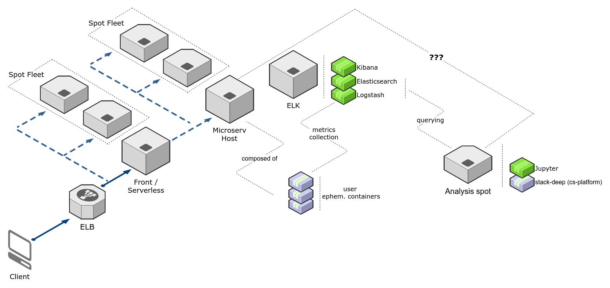

# pyfaas

## _docs

Contents:
+ [**`assets/`**](assets) - images/screenshots for docs
+ **`lncs_utils.zip`** - `.cls` / `.bst` for LNCS LaTeX template
+ [**`paper.tex`**](paper.tex) - LaTeX paper describing this project
+ [**`resources.bib`**](resources.bib) - bibliography for the LaTeX paper

### Current Architecture

### Usecase diagram

---

### Old Architecture

